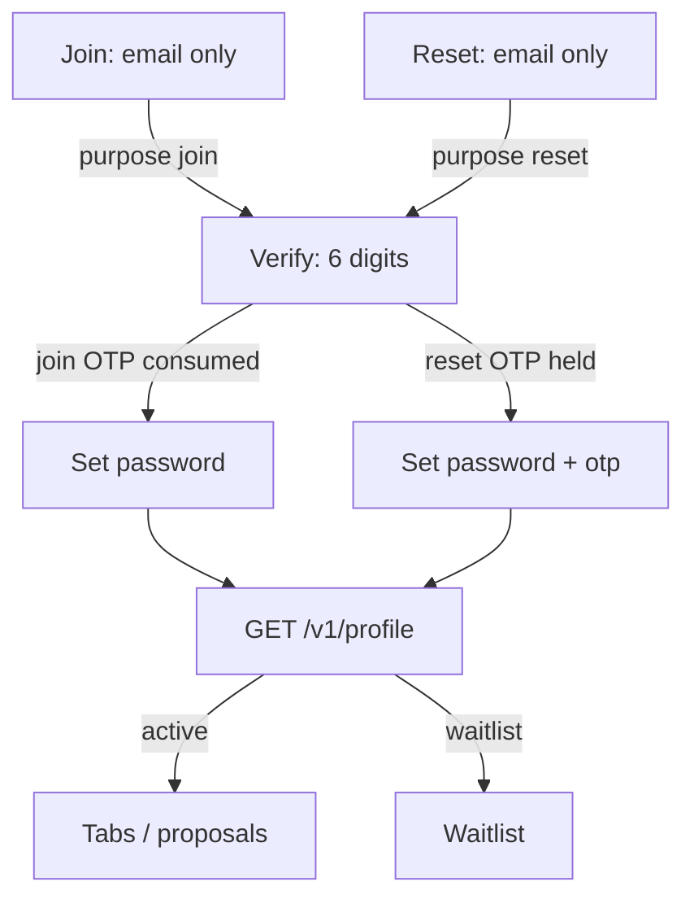

# ADR-PROD-001 — Open signup + waitlist, email → OTP → password, verify `purpose`

Status: accepted · Date: 2026-09-11 · Decider: Betty

Wiring identity without this document produces a Join that lies, a Reset that shares Join's endpoint, and a Better Auth slice that collects the password on the wrong screen.

---

## Context

The Expo entry flow (Welcome → Sign in / Join → Verify → Set password → `/home`) is UI only. The isolated Better Auth slice signs up with **email + password, then OTP**. Those two orders were treated as competing products. They are not: **the screens stay; the backend adapts.**

Three observations were also mistaken for three access policies:

1. Copy on Join: “we'll recognise you.”
2. Identity: constant-shape OTP response (no email oracle).
3. Members: `crm.mirror` → `active` vs `waitlist`.

They are one policy, badly explained. This ADR writes it down.

---

## Decision

### 1. Who may join — open signup + waitlist (Betty, variant B)

Anyone may request a code and complete Join. Identity **always** creates an `auth.user` once the OTP succeeds.

`crm.mirror` (normalized email) decides **status**, not whether the account exists:

| CRM match | `members.profile.status` |
| --------- | ------------------------ |
| Found     | `active`                 |
| Not found | `waitlist`               |

Constant-shape replies (`CONSTANT_OTP_SENT`, `CONSTANT_RESET_SENT`) are **anti-enumeration**, not a third policy. Unknown emails still receive a join code. Difference appears **after** verification, on `profile.status`.

Copy on Join (English, sentence case) must not imply a closed club:

> If you've flown with us, use the email your advisor has on file — we'll recognise you and set things up. If you're new, we'll add you to the list.

**Flag:** `members.allow_non_crm_signups` in the snapshot handler currently promotes unknown emails to `active`. That contradicts this ADR. In v1 it stays **off** (or is removed). Waitlist is the only path for emails absent from `crm.mirror`.

**After success:** session exists → `GET /v1/profile` (or equivalent facade). `active` → tabs (Proposals). `waitlist` → waitlist screen. That screen is Stage 4; until it ships, waitlist members **must not** land on the member feed. A stub waitlist route is allowed. `/home` as a shared dump is not.

Sign-in validation (`Email` / `Password` in `schemas.ts`, voice from `auth-messages.ts`) ships with API wiring, not before.

### 2. Join order — email → code → password. Backend adapts. Screens do not.

Rejected (Betty): putting the password on the Join screen (option C). It matches the current Better Auth slice (`signUp.email({ email, password })`) and contradicts the product.

Preferred adaptation, in order:

**A (preferred).** `emailOTP` with `disableSignUp: false` (Better Auth default). Join sends a **`sign-in` OTP**, not `email-verification`. `POST /sign-in/email-otp` creates the user if missing. Then set the password on the new session.

`verifyEmail` **does not create users** (unknown email → `USER_NOT_FOUND`). Do not use it for Join.

`auth.api.setPassword` is **server-only**. The app calls a club route (e.g. `POST /v1/me/password`) that forwards the session cookie. The Expo client must not call `setPassword` itself.

**B (fallback).** Join creates the user with a cryptographically random password nobody sees; Set Password replaces it. Works if A fails the checklist below. Document the temp credential window in `core/identity` MODULE.md. The member must not be able to sign in with the temp password (`requireEmailVerification: true`, `autoSignIn: false`).

Do not implement B until A is checked against the **installed** `better-auth` version.

The snapshot `join(email, password)` in `isolated/identity-production/.../flows.ts` is **superseded**.

### 3. Verify carries `purpose` — obligatory before any auth call

```
/verify-code?email=<normalized>&purpose=join|reset
```

Missing or unknown `purpose` → treat as `join` (deep links). Never infer purpose from “how we got here.”

| `purpose` | Verify collects | Consumes OTP                                                   | Next screen                                                                                  |
| --------- | --------------- | -------------------------------------------------------------- | -------------------------------------------------------------------------------------------- |
| `join`    | 6-digit code    | Yes: `signIn.emailOtp` (path A) or `verifyEmail` (path B)      | Set password (skip if a credential password already exists)                                  |
| `reset`   | 6-digit code    | **No** on this screen. Optional `check-verification-otp` only. | Set password with `{ email, otp, purpose: "reset" }` → `emailOtp.resetPassword` then sign-in |

Reset must not call Join's verify endpoint. Join must not call `resetPassword`.

Resend uses the same `purpose`: join → `sign-in` (A) or `email-verification` (B); reset → `forget-password`.

---

## Screen contract (Expo)



| Screen       | Params in                          | Params out                                                              | API when wired                                               |
| ------------ | ---------------------------------- | ----------------------------------------------------------------------- | ------------------------------------------------------------ |
| Join         | —                                  | `email`, `purpose=join`                                                 | Send join OTP; UI always `CONSTANT_OTP_SENT`                 |
| Reset        | —                                  | `email`, `purpose=reset`                                                | Request reset OTP; UI always `CONSTANT_RESET_SENT`           |
| Verify       | `email`, `purpose`                 | join: session then Set password; reset: `email`, `otp`, `purpose=reset` | See table above                                              |
| Set password | `email`, `purpose`, `otp` if reset | —                                                                       | join: server `setPassword`; reset: `resetPassword` + sign-in |
| Gate         | session                            | —                                                                       | `profile.status`                                             |

Until the API exists, the screens only plumb these params. They still must not send Reset through a Join-only verify handler.

---

## Checklist — path A on the installed Better Auth

Run against the version that will ship (not “the docs in general”). If any box fails, stop and take B.

- [ ] `emailOTP({ disableSignUp: false })` still auto-creates on `POST /sign-in/email-otp`.
- [ ] Join send uses `type: "sign-in"`. `type: "email-verification"` + `verifyEmail` does **not** create a user.
- [ ] Expo plugin stores the session cookie after `signIn.emailOtp`.
- [ ] `databaseHooks.user.create` still publishes `member.registered` for OTP-created users (outside Better Auth's transaction; members reconcile remains).
- [ ] Server `auth.api.setPassword({ body: { newPassword }, headers: session })` works for an OTP-created user with no credential account.
- [ ] HIBP refusal still applies to that set-password.
- [ ] Rate limits on send / verify / set-password still match identity MODULE.md.
- [ ] Existing member who walks Join: constant copy; after OTP they skip Set password if a credential already exists.
- [ ] Note: Better Auth may **strip an existing password** when a previously unverified account verifies via sign-in OTP. Confirm and, if true, send those users through Set password, not the feed.
- [ ] Unknown email on Reset: no oracle; verify/set-password fail calmly (`auth-messages.ts`).

Path B extra:

- [ ] Temp password never logged, never returned, never in analytics.
- [ ] Sign-in with the temp password fails until email is verified and the password is replaced.
- [ ] MODULE.md records the window between Join and Set password.

---

## Consequences

- Identity slice is rewritten around OTP-first Join; `flows.ts` `join(email, password)` is deleted at wiring.
- Members v1: unknown CRM email → `waitlist`, never `active` via a flag.
- Waitlist UI is a hard dependency of “don't dump everyone on `/home`,” even as a stub.
- Delete-account (Apple 5.1.1(v)) stays in identity; not blocked by this ADR.
- PLAN D3 (delete `club.ts`, Uniwind) is unchanged and **not** brought forward. AGENTS.md still names `club.ts` until day 3.
- Serif (Newsreader vs Source Serif 4) stays an open Betty decision (D-Betty), not a conflict.

---

## Follow-up order

1. Join copy (this change).
2. This ADR.
3. `purpose` on Verify / Set password (params only).
4. Path A checklist on installed Better Auth; B only if A fails.
5. API wiring + sign-in Zod/`auth-messages` + profile gate.

Do not wire Better Auth until steps 1–4 are done.
